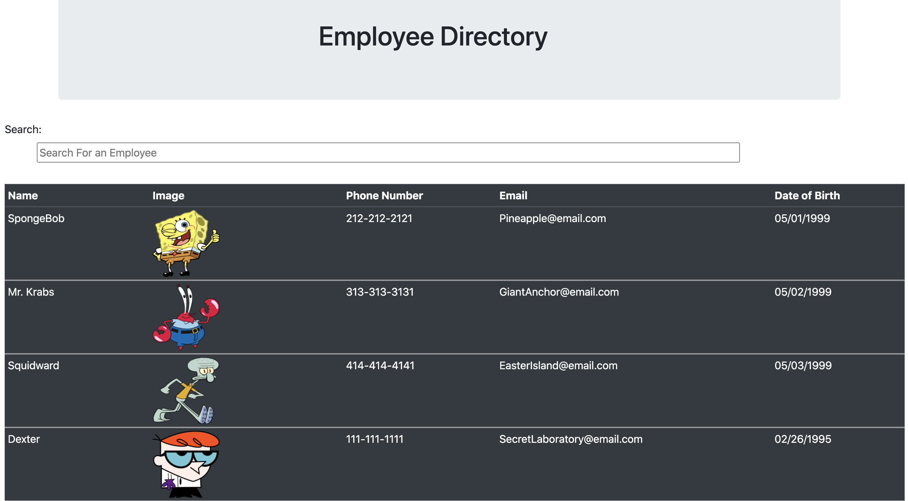

# EmployeeDirectory
## Description
This app is a React-based app that allow a user to filter through all of the employees listed by the employee name. Please use the following link to access the deployed site: https://albie140.github.io/EmployeeDirectory/
## Image

## Usage
To use this app simply follw the steps below.

* Follow link to deployed site
* In the search bar, start typing to filter employees based on their name

## License

